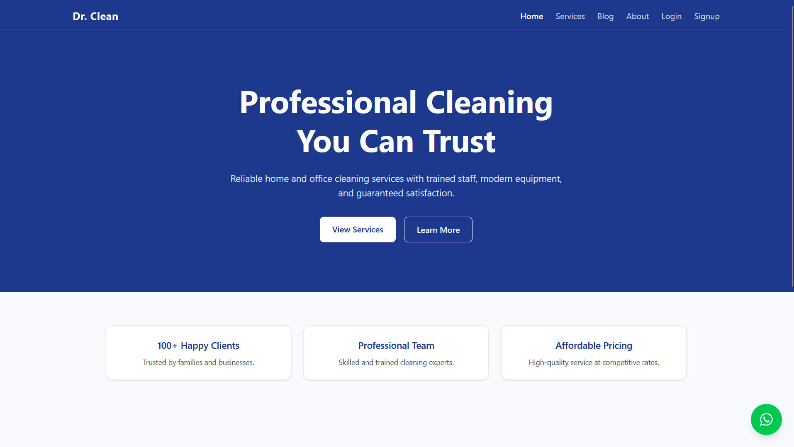
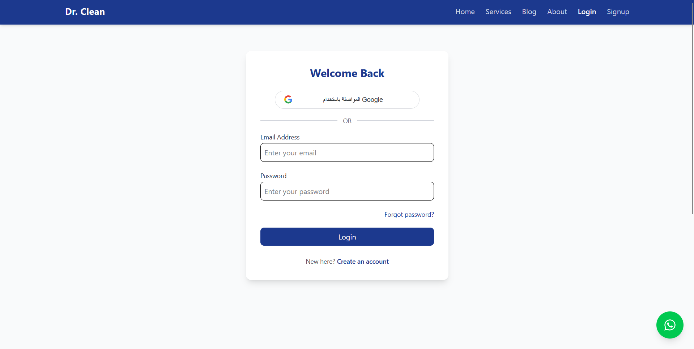
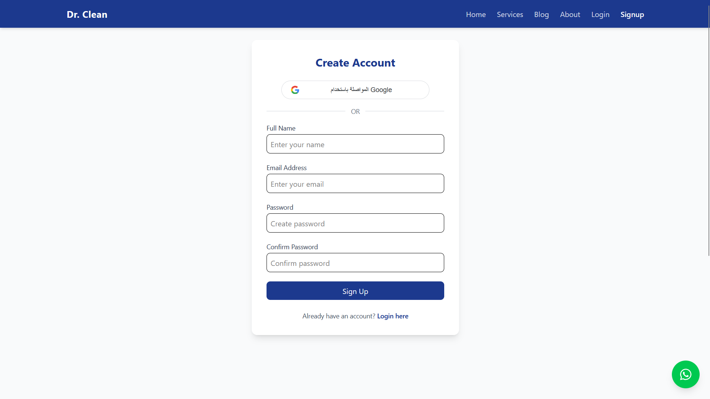
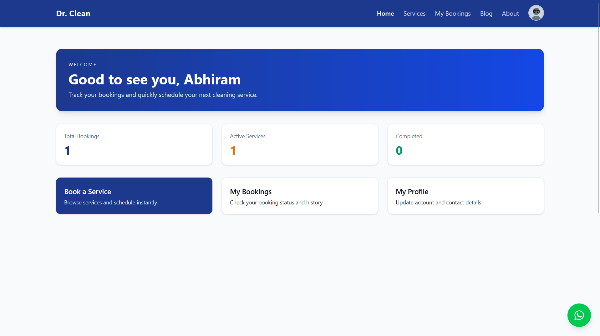
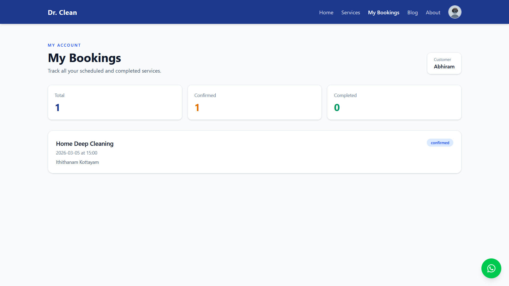
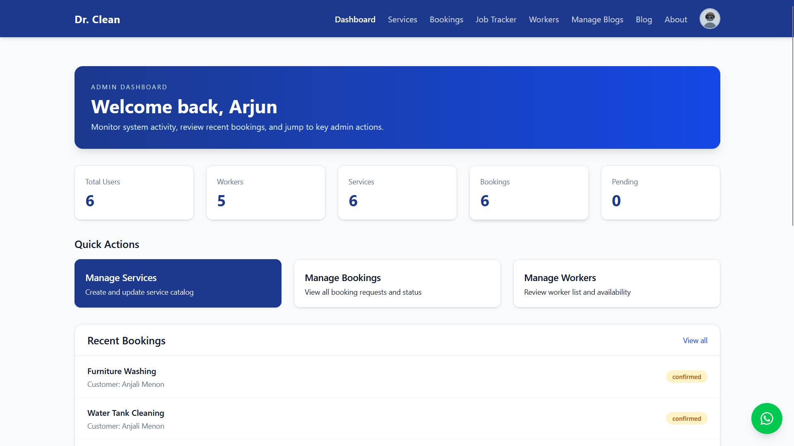
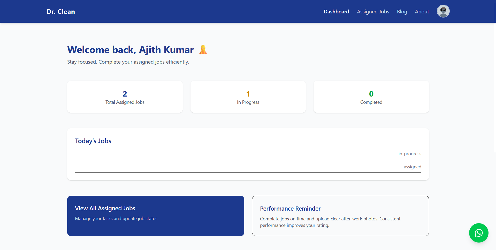

# Dr. Clean Project

**A full‑stack home services platform built with React, Node.js, and MongoDB**

---

## 🧩 Overview

Dr. Clean is a web application that connects customers with cleaning and maintenance service providers. It features separate clients for users, workers, and administrators, allowing each role to manage bookings, profiles, blogs, jobs, and more.

The repository is split into two main folders:

- **Client/** – Frontend built with React (Vite) and Tailwind CSS.
- **Server/** – Backend API using Express.js, MongoDB (Mongoose), and Cloudinary for image handling.

---

## 🚀 Features

- **Authentication** (email/password, JWT-based)
- **Role-based access control** (user, worker, admin)
- **Service browsing & booking**
- **Profile management (security, edit profile)**
- **Admin dashboard** for managing users, services, bookings, blogs, and workers
- **Worker dashboard** for job assignment tracking
- **Blog creation and viewing**
- **Image uploads via Cloudinary**
- **Protected routes and middleware validations**

---

## 📷 Screenshots

Below are a few example views from the application. Save your images in a `screenshots/` folder at the project root and update the paths as needed.

| Description           | Preview                                                          |
| --------------------- | ---------------------------------------------------------------- |
| Public homepage       |                    |
| Login page            |                              |
| Signup page           |                          |
| User dashboard        |                 |
| User booking page     |                |
| Admin manage services | .png) |
| Admin dashboard       |               |
| Worker dashboard      |             |

> 📁 **All screenshot files** are located in the `screenshots/` folder. Filenames include spaces and describe the page; feel free to update this table with any additional views you want to highlight.

## 🛠 Tech Stack

---

## 🛠 Tech Stack

| Layer          | Technology                          |
| -------------- | ----------------------------------- |
| Frontend       | React, Vite, Tailwind CSS, Axios    |
| Backend        | Node.js, Express, MongoDB, Mongoose |
| Dev Tools      | ESLint, Prettier, Vite, nodemon     |
| Authentication | JWT, bcrypt                         |
| Storage        | Cloudinary (images)                 |

---

## 📁 Project Structure

```
Client/
  ├─ src/                  # React source code
  │   ├─ Components/       # Reusable UI components
  │   ├─ Pages/            # Route components
  │   ├─ Context/          # Auth provider, etc.
  │   ├─ Routes/           # React Router setup
  │   └─ Axios/            # Axios configuration

Server/
  ├─ config/               # Database & cloudinary setup
  ├─ Controllers/          # Route handlers
  ├─ Middleware/           # Auth, validation, file uploads
  ├─ Models/               # Mongoose schemas
  ├─ Routes/               # Express routing
  ├─ scripts/              # Seed data script
  └─ Utilities/            # Helpers (tokens, passwords)
```

---

## 🔧 Getting Started

### Prerequisites

- Node.js (v16+)
- npm or yarn
- MongoDB URI (local or Atlas)
- Cloudinary account (for image uploads)

### Setup Instructions

1. **Clone the repository**

   ```bash
   git clone <repository-url>
   cd "Dr. Clean/Project"
   ```

2. **Server setup**

   ```bash
   cd Server
   npm install

   # create a `.env` file with:
   #  MONGO_URI=your_mongo_connection_string
   #  JWT_SECRET=your_secret
   #  CLOUDINARY_CLOUD_NAME=
   #  CLOUDINARY_API_KEY=
   #  CLOUDINARY_API_SECRET=

   npm run dev   # starts Express server on configured port
   ```

3. **Client setup**

   ```bash
   cd ../Client
   npm install
   npm run dev    # starts Vite dev server (usually http://localhost:5173)
   ```

4. **Seeding data (optional)**
   ```bash
   node ../Server/scripts/seed.js
   ```

---

## 🧪 Testing

_No automated tests included_. Manual testing can be performed through the UI or by using tools like Postman / Insomnia against the API endpoints.

---

## 📝 API Endpoints

The server exposes versioned routes under `/api/v1`. Example groups include:

- `/auth` – registration, login
- `/users` – profile, security
- `/services` – list, create, update (admin)
- `/bookings` – create, view, manage
- `/blogs` – CRUD operations
- `/assigned-jobs` – worker assignments

Refer to controllers and routes directories for full details.

---

## 🛡 Security & Middleware

- `authMiddleware.js` protects private endpoints
- `adminAuthMW.js` restricts admin-only actions
- `fieldsValidation.js` enforces schema checks
- Uploaded files are handled by `multer.js` and sent to Cloudinary

---

## 🧠 Development Notes

- The client uses React Router v6 and context for authentication state.
- Axios instances are centralized (`Axios/axiosInstance.js`) to include base URL and token.
- Admin and worker dashboards have guards using `ProtectedRoute.jsx`.
- Styling is managed with Tailwind; configuration lives in `tailwind.config.js`.

---

## 📦 Deployment

- Build the frontend using `npm run build` inside `Client` and serve the output with a static server or integrate with the Express backend.
- Ensure environment variables are set for production (MongoDB, Cloudinary, JWT secret).

---

## 🤝 Contributing

Feel free to open issues or submit pull requests. Follow conventional commits and include descriptive messages.

---

## 📄 License

[MIT](LICENSE) (or specify whichever license applies)

---

**Happy coding!** 🎉
